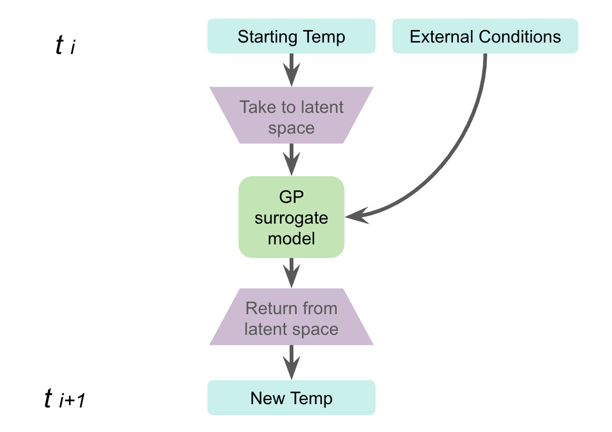

# ukaea-sysuq-box
System Uncertainty Quantification (SysUQ) for a box.

`SysUQ.ipynb` walks through a full surrogate modelling workflow:
- setup and authentication with the Uncertainty Engine,
- data preparation and latent-space construction,
- cloud training with TorchScript export,
- local rollout, uncertainty propagation, and visualisation.

## Quick start
1. Create a `.env` file and add in your Uncertainty Engine credentials:
   1. UE_USERNAME=[your email]
   1. UE_PASSWORD=[your password]
2. Install dependencies from `requirements.txt`.
3. Add a folder for data
4. Add the IN_OUT data folder to data/IN_OUT
5. Run the `SysUQ.ipynb` notebook top to bottom.

## Model Overview
- The notebook sets up a functional mock up unit (FMU). 
- This unit returns the updated block temperature given the previous temperature of the block, any external conditions, and the time step.
- 
